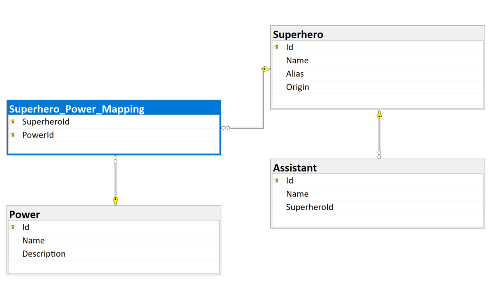

# Backend Development Assignment 2

This assignment is about creating a database and accessing a database.

Contributors: Richard Stølen and Ahmad Khodabaks

Appendix A:
Has a folder with all the individual scripts, and also a script 10_completeScript.sql that contains everything that can be run with SSMS. There is also a main program in the solution that goes through the sqlscripts folder and runs every script. It works fine, but needs to change to the local DB Datasource to work.

Appendix B: test

Contains two branches:
- main
    - Contains the main implementation for Appendix B, the main program has a test run with all the methods.   
- richard-experimental-delegates
    - Experimental branch with delegates to try to limit all the using cases when creating a new SqlConnections and such.

## To Do List

### Appendix A: SQL scripts to create database

1. [x] Creating a database. The database should be called SuperheroesDB. (01_dbCreate.sql)
2. [x] Create the tables (Superhero, Assistant, Power). (02_tableCreate.sql)
3. [x] Create the relationship between Superhero and Assistant (03_relationshipSuperheroAssistant.sql)
4. [x] Create the relationship between Superhero and Powers (04_relationshipSuperheroPower.sql)
5. [x] Insert three new superheroes (05_insertSuperheroes.sql)
6. [x] Insert three new assistants (06_insertAssistants.sql)
7. [x] Insert foure new powers (07_powers.sql)
8. [x] Update a superheroes name (08_updateSuperhero.sql)
9. [x] Delete a assistant (09_deleteAssistant.sql)

### Appendix B: Reading data with SQL Client

1) Introduction and overview
For this part of the assignment, you are given a database to work with. It is called Chinook.
Chinook models the iTunes database of customers purchasing songs. You are to create a C# console application, install
the SQL Client library, and create a repository to interact with the database.
NOTE: These requirements are separate from Appendix A.

2) Customer requirements

1. [x] Read all the customers in the database, this should display their: Id, first name, last name, country, postalcode, phone number and email.
2. [x] Read a specific customer from the database (by Id), should display everything listed in the above point.
3. [x] Read a specific customer by name. HINT: LIKE keyword can help for partial matches.
4. [x] Return a page of customers from the database. This should take in limit and offset as parameters and make use
of the SQL limit and offset keywords to get a subset of the customer data. The customer model from above
should be reused.
5. [x] Add a new customer to the database. You also need to add only the fields listed above (our customer object)
6. [x] Update an existing customer.
7. [x] Return the number of customers in each country, ordered descending (high to low). i.e. USA: 13, ...
8. [x] Customers who are the highest spenders (total in invoice table is the largest), ordered descending.
9. [x] For a given customer, their most popular genre (in the case of a tie, display both). Most popular in this context
means the genre that corresponds to the most tracks from invoices associated to that customer.

### Appendix A Class diagram

